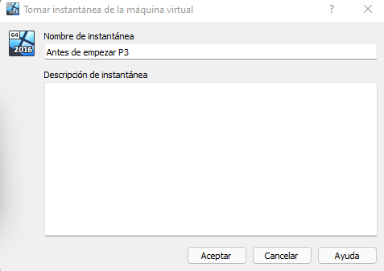
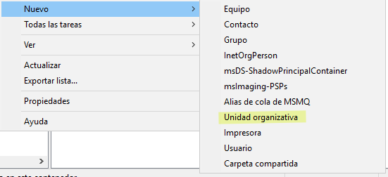
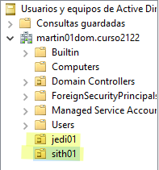
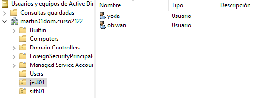
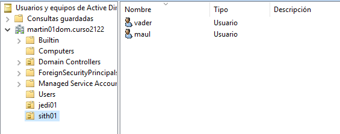

# Políticas de grupo

# 1. Aplicar directivas de Usuario

Creo una instantánea en la MV PDC antes de empezar la práctica por seguridad.

---

En "Usuarios y equipos del Active Directory" creo una nueva unidad organizativa.

---

Creo las unidades **jedi01** y **sith01**.

---

Añado los usuarios a la unidad jedi.

---

Añado los usuarios a la unidad sith.

---