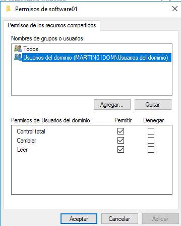

# Políticas de grupo

# 1. Aplicar directivas de Usuario

## 1.1 Crear las OU

Creo una instantánea en la MV PDC antes de empezar la práctica por seguridad.

---

En "Usuarios y equipos del Active Directory" creo una nueva unidad organizativa.

---

Creo las unidades **jedi01** y **sith01**.

---

Añado los usuarios a la unidad jedi.

---

Añado los usuarios a la unidad sith.

---

## 1.2 Crear GPO's

Voy a `Herramientas -> Administración de directivas de grupo` y en la OU de **jedi01** -> botón derecho -> y creo la **GPO_jedi01**.

---

Compruebo que se han creado las GPO.

---

## 1.3 Personalizar cada GPO de forma diferente

Para la directiva **gpo_jedi01** aplico las siguientes directivas.

 

Directivas de `Menú inicio y barra de tareas` aplicada a la OU de **jedis**.

---

Directivas de `Panel de control` aplicadas a la OU de **siths**.

---

Ahora aplico directivas a la OU de **sith01**.

 

Directivas de escritorio y explorador de windows aplicadas a la OU de **siths**.

`NOTA: en "Ocultar estas unidades específicas en Mi PC" eligo la combinación de bloquear solo las unidades A y B`

---

## 1.5 Comprobar que se aplican las directivas

Resumen de configuración de la OU **jedi**.

---

Resumen de configuración de la OU **sith**.

---

Entro con el usuario obiwan del dominio en la MV cliente y compruebo que no deja entrar al panel de control ni a configuración.

---

En este mismo usuario compurebo que no aparece el icono de red.

---

# 2. Paquete MSI

Creo la carpeta **e:\software**.

---

Comparto esta carpeta como recurso de red y le doy permiso total a todos los usuarios del dominio.

---

## 2.2 Crear el paquete MSI con EMCO Software

