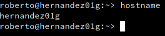

# Cliente GNU/Linux

## Preparar el cliente

Cambio el nombre de host de la máquina.

---

Establezco las DNS de la máquina.

---

Compruebo el DNS

---

## Unirse al dominio

En `Yast -> Pertenencia a dominio de Windows` Pongo el nombre de mi dominio, activo la autenticación SMB y creo el home del usuario al iniciar sesión.

Introduzco las credenciales del **Administrador** del dominio.

