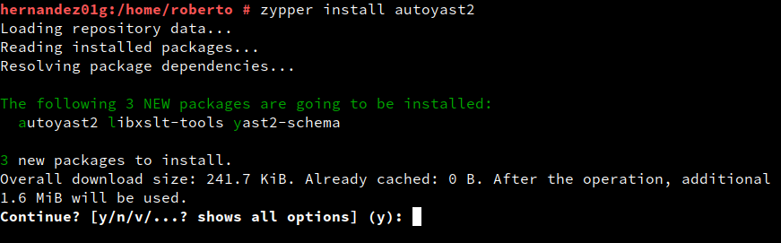
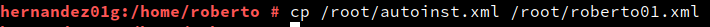
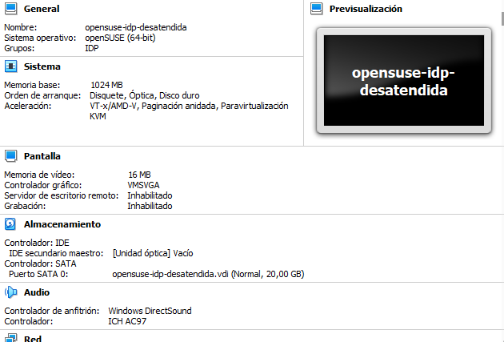
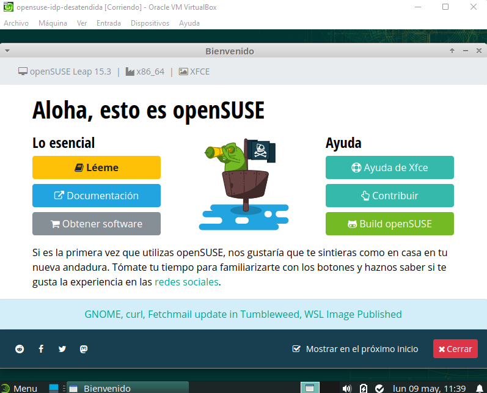
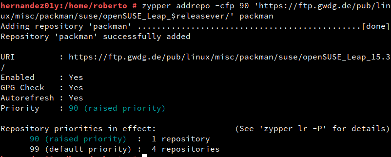
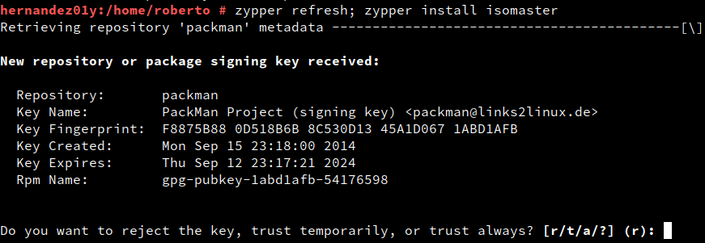
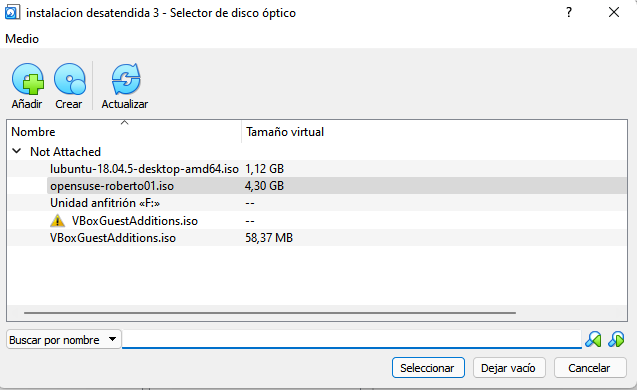
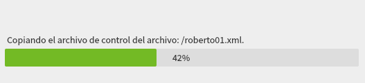

# Instalación desatendida

# 2 Preparativos

## Personalizamos la MV

Instalon **inkscape**.

---

Instalo **vlc**.

---

# 3. Fichero de respuestas

Instalo **autoyast 2**.

---

Clono el sistema haciendo uso del comando **/sbin/yast2 clone_system**.

---

Hago una copia de seguridad del perfil.

---

## 3.2 Configurar USB en la MV de VirtualBox

Añado el USB en VirtualBox.

---

## 3.3 Copiar fichero XML en pendrive

Localizo dónde está montado el pen-drive y copio el archivo xml al usb.

---

Creo una MV2 nueva con un tamaño de disco duro similar a la anterior.

---

Añado el USB a la máquina virtual.

---

Eligo instalación y en opciones de arranque escribo **autoyast=usb:///roberto01.xml**.

---

Se instala todo sin problema y compruebo que se guarda el usuario y toda la configuración.

---

# 5. Instalación desatendida desde ISO

## 5.1 Software para editar ficheros ISO

Añado el repositorio para poder descargar isomaster.

---

Instalo isomaster.

---

## 5.2 Peparar la ISO

Inicio isomaster y añado mi archivo .xml al .iso.

---

Grabo la iso modificada como **opensuse-roberto01.iso**.

---

## 5.3 Instalación desatendida desde la ISO

Creo una tercera máquina virtual con el mismo tamaño de disco.

---

Introduzco la iso en la MV3.

---

Veo que OpenSUSE reconoce el archivo .xml.

---

Inicio la máquina después de la instalación y compruebo que el nombre dehost es el mismo, se guarda el usuario y los programas que tenía en la anterior máquina.

---