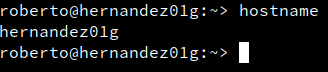
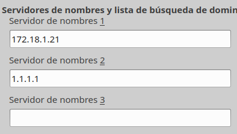
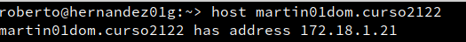
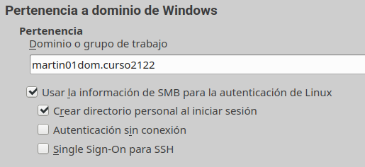
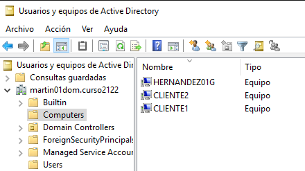
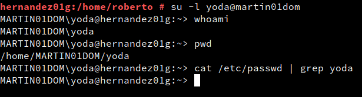
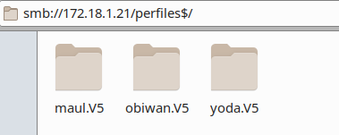

# Cliente GNU/el cliente

Cambio el nombre de host de la máquina.

En la máquina linux establezco como DNS la ip del Windows Server y como secundario 1.1.1.1.

Compruebo el DNS en la terminal.

## 3.Unirse al dominio

En `Yast -> Pertenencia a dominio de Windows` Pongo el nombre de mi dominio, activo la autenticación SMB y creo el home del usuario al iniciar sesión.

Introduzco las credenciales del **Administrador** del dominio.

Compruebo en el PDC que se ha unido correctamente el host.

## 4. Abrir sesión en el cliente

Como superusuario, inicio sesión como el usuario **yoda** y ejecuto los comandos **whoami**, **pwd** y **cat /etc/passwd | grep yoda** para comprobar que se ha iniciado sesión correctamente en el dominio.

## 5. Recursos compartidos

En el explorador de archivos de linux escribo `smb://ip-del-pdc/perfiles$`, esto me lleva a los recursos compartidos de windows server.
