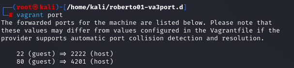
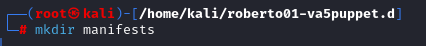

# Instalación desatendida con vagrant

# 1. Proyecto: Añadir cajas

## 1.1 Imagen, caja o box

Añado la box de vagrant llamada **ubuntu/bionic64**.

Compruebo que se ha añadido la box.

## 1.2 Directorio

Creo el directorio **roberto01-va1box.d**

Dentro de esta carpeta creo el archivo **Vagrantfile** y escribo esto en su interior.

## 1.3 Comprobar

Inicio una nueva instancia de la máquina virtual.

Entro a la MV usando SSH.

## 1.4 Elimianmos la MV

Salgo de la MV, la paro y le elimino.

# 3. Proyecto: Redirección de puertos

## 3.1 Creamos los ficheros

Completo el archivo Vagrantfile para que tenga 2048 MiB de ram y para que el sistema sea enrutado al puerto 80.

## 3.2 Entramos en la MV

Entro en la MV e instalo Apache2.

## 3.3 Comprobar

Veo la redirección de puertos de la máquina Vagrant.

Accedo al puerto 80 del sistema virtualizado.

## 3.4 Eliminar la MV

Elimino la MV.

# 4. Proyecto: Suministro mediante shell script

## 4.1 Crear ficheros

Creo el fichero **index.html** y escribo dentro de él.

Creo un script.

## 4.2 Vagrantfile

Creo el fichero **Vagrantfile** y lo configuro.

## 4.3 Comprobamos

Compruebo que funcionó el apache.

# 5. Proyecto: Suministro mediante Puppet

## 5.1 Preparativos

Creo la carpeta.

Creo y modifico el archivo **Vagrantfile**.

Creo la carpeta **manifests**.

Creo el archivo roberto01.pp y lo modifico.

## 5.3 Comprobamos

Inicio la máquina.

Entro en la MV y compruebo que se ha instalado el software.

# 6. Proyecto: Caja personalizada

## 6.1 Preparar la MV VirtualBox

Utilizo una MV que ya tenía creada.

Creo el usuario **vagrant** y le pongo de contraseña **vagrant**.

 

Descargo la clave pública.

Modifico los permisos y el propietario de la carpeta.

Añado esta línea a /etc/sudoers.

# 6.2 Crear la caja Vagrant

Creo la carpeta para este paso, veo la lista de MV que tengo en VirtualBox y creo mi propia caja.

Añado la nueva caja al repositorio local de cajas de vagrant.

Compruebo la lista de cajas vagrant.

## 6.3 Vagrantfile

Edito el fichero Vagrantfile

Inicio la máquina.

Me conecto a la MV por ssh.

