## Servidor de actualizaciones con OpenSuse

## Servidor Web

## 1.1 Instalación

Instalo el servidor web Apache.

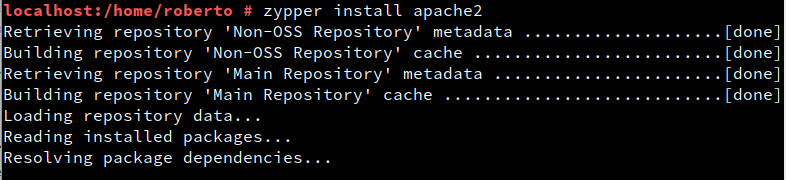

Activo que apache2 al inicio.

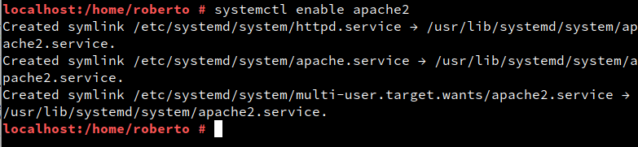

Compruebo el estado de apache2.

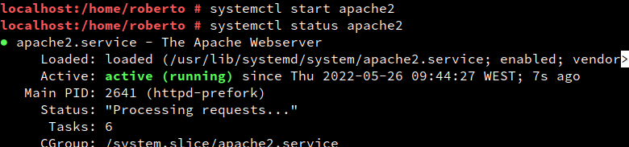

## 1.2 Cortafuegos

Abro el puerto 80 en el cortafuegos por comandos.

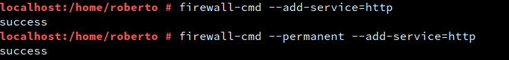

Creo el fichero /srv/www/htdocs/index.html y escribo mi nombre dentro.

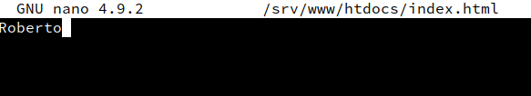

# 2 Preparar el repositorio local

## 2.1 Descargar ficheros rpm

Limpio todo lo que se haya quedado en caché de zypper.

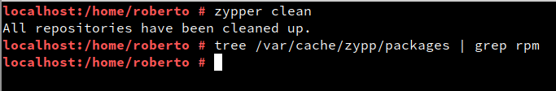

Descargo geany.

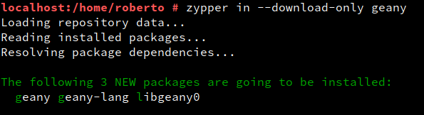

Descargo nmap.

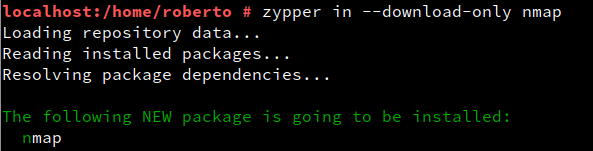

Descargo tree.

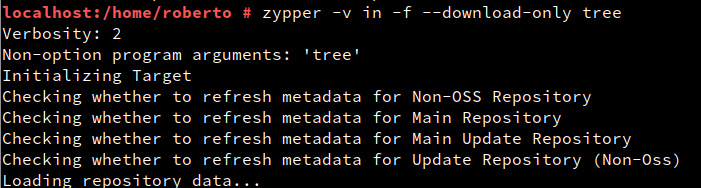

Veo los paquetes descargados.

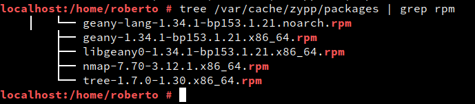

## 2.2 Copiar ficheros a nuestro repositorio.

Creo el directorio local **/srv/www/htdocs/repo/roberto01** 

Copio directorios y ficheros desde la caché de zypper.

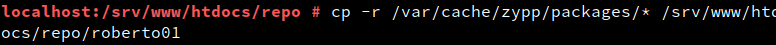

Compruebo el contenido del repositorio.

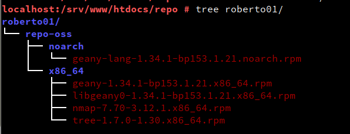

## 2.3 Crear el fichero índice

Instalo la herramienta createrepo.

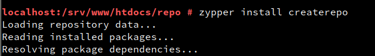

Compruebo el contenido actual del repositorio.

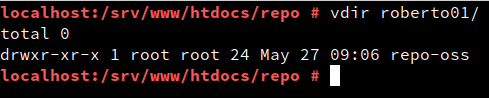

Creo lo índices de mi repositorio.

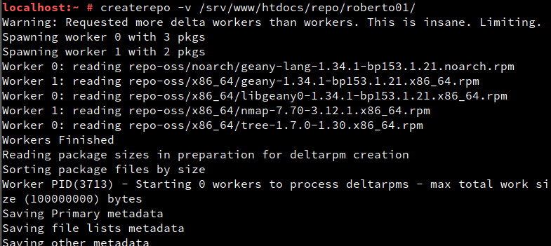

Compruebo el contenido final de mi repositorio.

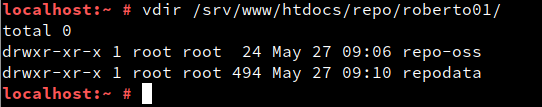

# 3. Cliente del repositorio

## 3.1 Comprobar acceso

Abro el navegador para comprobar que tengo acceso desde la MV2 a los ficheros de MV1.

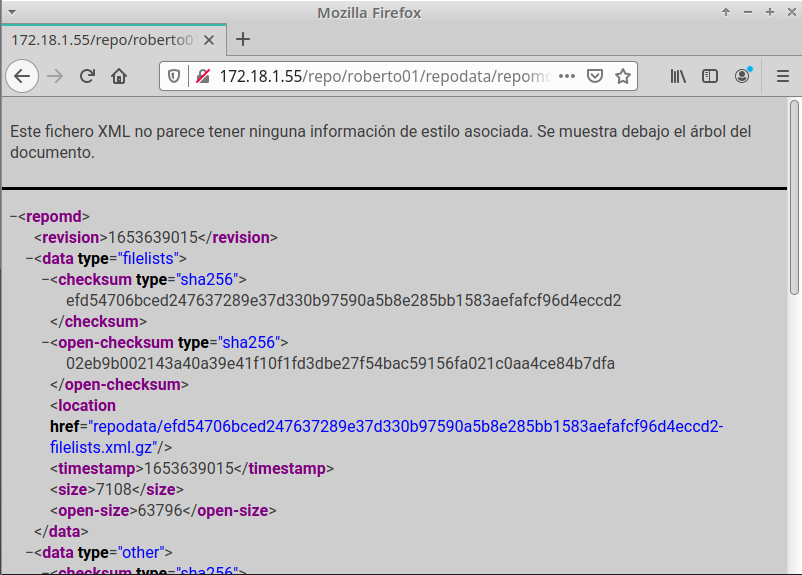

## 3.2 Añadir nuevo repositorio

Añado nuevo repositorio.

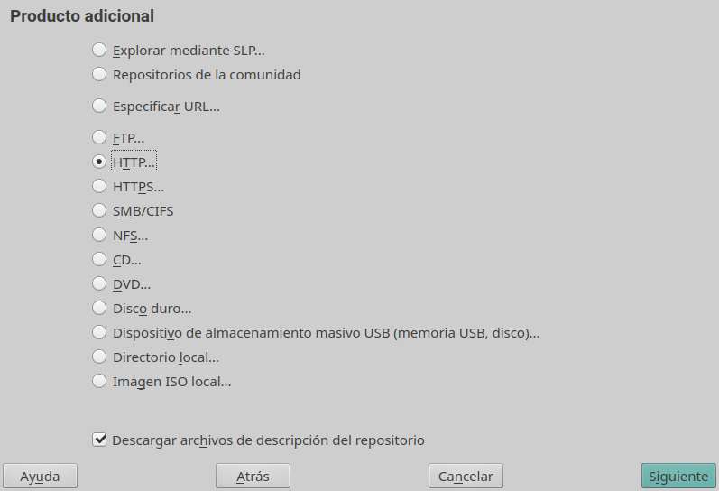

Establezco el nombre y la URL del repositorio.

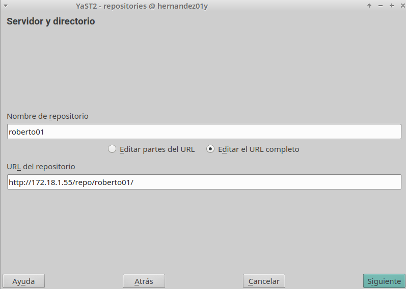

Listado de repositorios.

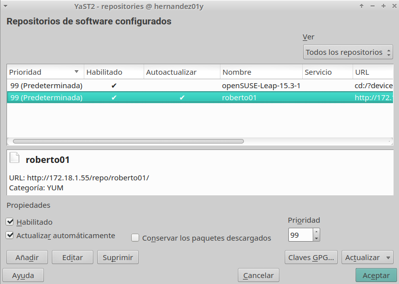

Compruebo que la configuración del repositorio nuevo está en este fichero de texto.

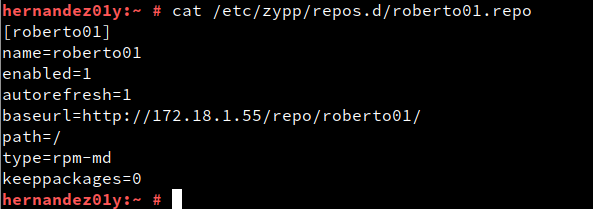

## 3.3 Comprobamos el repositorio desde el cliente

Refresco los repositorios y pruebo a instalar un paquete.

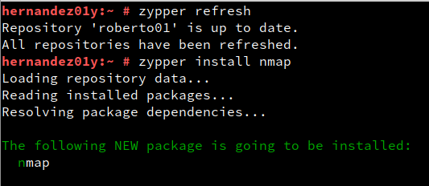

Pruebo la instalación de un paquete que no está en nuestro repositorio.

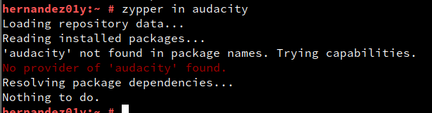