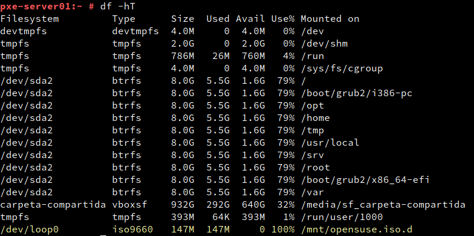

# Servidor PXE

# 2. Servicio DHCP

## 2.1 Instalar el servicio DHCP

Instalo el servicio DHCP.

## 2.2 Configurar interfaz de red

Hago copia de seguridad del fichero antes de modificarlo.

Edito el archivo **/etc/sysconfig/dhcpd**.

## 2.3 Configurar DHCP

Hago una copia del fichero antes de modificarlo.

Configuro DHCP.

Configuro el servicio "dhcpd" para que se inicie automáticamente.

# 3. Servicio TFTP

Instalo el servicio

## 3.2 Cambiar la configuración

Edito el archivo /etc/sysconfig/atftpd

  

Al editarlo de esta manera el servicio se ejcutará con el usuario tftp, por lo que me aseguro que existe.

# 4. Servicio NFS

## 4.1 Instalar el servicio

Instalo **nfs-kernel-server**.

Instalo **yast2-nfs-server**.

## 4.2 Configurar

Descargo una iso de opensuse.

Creo el directorio **/mnt/opensuse.iso.d**.

Edito el fichero **/etc/fstab** para crear un punto de montaje para la iso.

Monto las configuraciones de fstab.

Compruebo que se ha montado.

Añado esta línea a **/etc/exports**.

# 5. Menú de arranque

## 5.1 Preparando el menú

Creo directorios y copio archivos.

Añado estas líneas al archivo **default**.

## 5.3 Probando el menú desde el cliente

Inicio la máquina cliente y compruebo que muestra el menú PXE.

# 6. Configurar una imagen para instalar

Creo un subdirectorio para la .iso y copio archivos.

Edito el fichero **/srv/tftpboot/pxelinux.cfg/default**

Inicio la máquina cliente y compruebo que muestra la iso que configuré.

Selecciono la ISO y compruebo que comienza la instalación.

# 7. Otra ISO

Repito los pasos del apartado 6 para añadir otra iso.

Compruebo que comienza la instalación.

